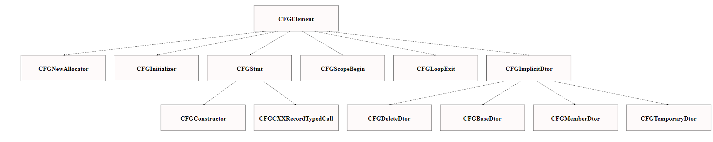

### C++11/C++14 Features that are used in LLVM:

* virtual : A virtual function defined in a class can be overridden by a child class. If a class has a pure virtual function, then each sub class which inherits it must ovveride this function.  
Reference: https://github.com/llvm/llvm-project/blob/main/clang/include/clang/Lex/ModuleLoader.h

* std::unique_ptr : It is a smart pointer which manages a object and deletes it when it goes out of scope.  
Reference: https://github.com/llvm/llvm-project/blob/main/clang/lib/Frontend/ASTUnit.cpp

* std::shared_ptr : It is a smart pointer which manages a object which has multiple owners.  
Reference: https://github.com/llvm/llvm-project/blob/main/clang/lib/Frontend/ASTUnit.cpp

* inline function : This is used to reduce function call overhead.  
Reference: https://github.com/llvm/llvm-project/blob/main/clang/include/clang/Lex/MacroInfo.h

* nullptr : nullptr is used instead of NULL from C++11.   
Reference: https://github.com/llvm/llvm-project/blob/main/clang/lib/Frontend/ASTUnit.cpp

* auto : This is used so that compiler can give the variable a type according to it's initialization.    
Reference: https://github.com/llvm/llvm-project/blob/main/clang/lib/Frontend/ASTUnit.cpp

* std::move : It is used to transfer resources.  
Reference: https://github.com/llvm/llvm-project/blob/main/clang/lib/Frontend/ASTUnit.cpp

* template : It is used for generic programming.  
Reference:  https://github.com/llvm/llvm-project/blob/main/clang/lib/Frontend/ASTUnit.cpp

* Non-static data member initializers : Used to initialize non static class variables instead of doing it in constructor.  
Reference: https://github.com/llvm/llvm-project/blob/main/clang/lib/Frontend/CompilerInstance.cpp

* default function : Reference: https://github.com/llvm/llvm-project/blob/main/clang/include/clang/Analysis/CFG.h

* Range based for-loops : Can iterate over list, vector etc..  
Reference: https://github.com/llvm/llvm-project/blob/main/clang/lib/Frontend/CompilerInvocation.cpp

---------------------------------------------------------------------

### Class Hierarchy:

Reference: https://github.com/llvm/llvm-project/blob/main/clang/include/clang/Analysis/CFG.h

The above class diagram represents hierarchical inheritance.

* Single inheritance, multilevel inheritance are used.
* Multiple inheritance i.e; a class having two parent classes is also used in some files.

---------------------------------------------------------------------

### OOP Design Decisions for LLVM:

#### Encapsulation:
Encapsulation is wrapping data variables and functions into a single unit, i.e; implementing a class/struct with data variables and appropriate methods to access them. This method is used in LLVM.  
Reference : https://github.com/llvm/llvm-project/blob/main/clang/include/clang/Frontend/ASTUnit.h

#### Abstraction:
Abstraction is showing user essential information like declarations of methods rather than their implementations i.e; a user can use a function without knowing how it is implemented. This is implemented in LLVM by having separate header files for class declarations.  
Reference : https://github.com/llvm/llvm-project/blob/main/clang/include/clang/Analysis/CFG.h

#### Inheritance:
To reduce redundancy we use inheritance. A class which inherits another class can derive all its properties. Various types of inheritance like single, multilevel, multiple inheritance are used in LLVM. Class hierarchy above shows inheritance implemented in a file.  
Reference: https://github.com/llvm/llvm-project/blob/main/clang/include/clang/Analysis/CFG.h

#### Polymorphism:
Polymorphism is implemented by overloading operators, functions. Runtime-polymorphism is used in llvm by implementing virtual functions.   
Reference: https://github.com/llvm/llvm-project/blob/main/clang/include/clang/Frontend/FrontendActions.h

---------------------------------------------------------------------------

### Design Patterns:

LLVM used factory,observer as design patterns.  
Factory pattern:  
Reference: https://github.com/llvm/llvm-project/blob/ea069aebccd317f350be3cabdcd848476616d4da/clang/include/clang/Analysis/BodyFarm.h

Observer pattern:  
Reference: https://github.com/llvm/llvm-project/blob/main/clang/include/clang/Analysis/Analyses/LiveVariables.h

---------------------------------------------------------------------------

### Usage of iterators and their own data structures:
